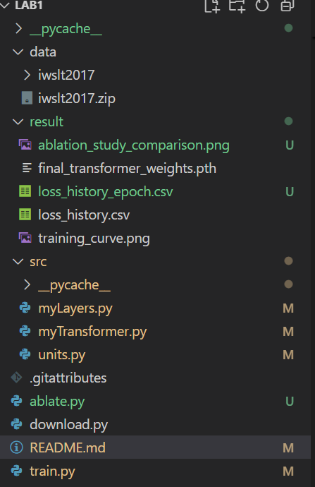

# LAB1: Transformer 架构从零实现与消融研究 (IWSLT2017 MT)

本项目是《大型模型基础与应用》课程的期中作业。目标是从零开始（手工）搭建一个完整的 **Encoder-Decoder Transformer** 模型，并在机器翻译（Machine Translation, MT）任务上验证其有效性，并通过消融实验分析核心组件（Layer Normalization 和 Residual Connections）的重要性。

## 1. 仓库结构

本项目结构如下：

## 2. 硬件与环境要求

* **Python 版本：** 3.8+
* **硬件要求：** 建议配备 **NVIDIA GPU** (8GB 显存或更高) 以加速训练。
* **重要：** 为确保实验稳定进行，训练前需设置 **Intel MKL 冲突环境变量**。

## 3. 安装与运行

推荐使用 Conda/Miniconda 进行环境管理。所有命令都在 **Git Bash** 或支持 Bash 的终端中运行。

### 3.1 环境设置 (一次性)

```bash
# 1. 创建并激活环境
conda create -n llm_lab1 python=3.10 -y
conda activate llm_lab1

# 2. 安装 PyTorch (请根据你的 CUDA 版本替换此行)
# 示例：conda install pytorch torchvision torchaudio pytorch-cuda=12.1 -c pytorch -c nvidia

# 3. 安装其他依赖
pip install transformers datasets pandas matplotlib sacrebleu

# 4. 配置 Git LFS (必须，用于处理模型权重)
git lfs install
git lfs pull

# 5. 解决 MKL 冲突（防止在绘图/评估阶段程序崩溃）
export KMP_DUPLICATE_LIB_OK=TRUE

# 6. 运行消融实验脚本 (随机种子已在代码中固定为 42)
python ablate.py